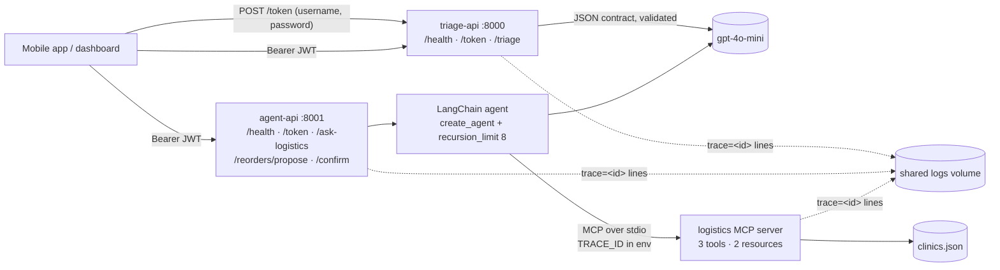

# AfyaPlus Service Platform: Engineering Report

Release **v1.1.0** · images `afyaplus-triage:1.1.0` (266 MB) and `afyaplus-agent:1.1.0` (379 MB) · 50 automated tests · total OpenAI spend for the whole build under **$0.01**

## 1. What was built



| Layer | Implementation | Evidence |
|---|---|---|
| Secure API | `triage_api.py`, `auth.py` (bcrypt, HS256 JWT with `sub` + `role`, 30 min), `rate_limit.py` | [01_secure_api_curl.txt](../evidence/01_secure_api_curl.txt): 200 / 401 / 403 / 422 / 429 / 503 |
| Container | `Dockerfile`, `Dockerfile.agent`, `.dockerignore`, `docker-compose.yml` | [02_docker_build.txt](../evidence/02_docker_build.txt), [02_docker_runtime.txt](../evidence/02_docker_runtime.txt), [05_compose_stack_runtime.txt](../evidence/05_compose_stack_runtime.txt) |
| MCP server | `logistics_mcp.py`: `check_stock`, `plan_delivery_route`, `get_delivery_eta`, `clinics://directory`, `clinics://{clinic_id}` | [03_mcp_inspector_cli.txt](../evidence/03_mcp_inspector_cli.txt), `tests/test_logistics_mcp.py` |
| Agent | `agent.py`, `agent_api.py` (reuses `auth.py` unchanged) | [04_agent_transcripts.md](../evidence/04_agent_transcripts.md) |

## 2. Version control

**Workflow.** Trunk-based: every change landed on a short-lived branch merged with `--no-ff`, so each deliverable is one visible bubble in the graph. Policy: [CONTRIBUTING.md](../CONTRIBUTING.md).

```text
*   571fda2 Merge branch 'feature/agent-api-title'          <- conflict resolved here
|\
| * 471deea docs(agent-api): rename the API title to Logistics Assistant
* |   09cac62 Merge branch 'hotfix/agent-api-description'
|\ \
| |/
|/|
| * 62f6727 docs(agent-api): describe the recommend-only contract on /docs
|/
*   1d47e03 Merge branch 'feature/compose-stack'            <- tag v1.1.0
*   e286816 Merge branch 'feature/logistics-agent'
*   8e0119d Merge branch 'feature/logistics-mcp'
*   f9b3cc0 Merge branch 'docs/d2-evidence'
*   f57012b Merge branch 'feature/containerise'             <- tag v1.0.0
*   1914885 Merge branch 'feature/secure-triage-api'
*   224c27f chore: initialise repository with secret-safe ignore rules
```

**Tags match images.** `v1.0.0` → `afyaplus-triage:1.0.0`; `v1.1.0` → `afyaplus-triage:1.1.0` and `afyaplus-agent:1.1.0`. `/health` reports the same number, from `config.VERSION`. Each tag was placed only **after** its image had built and run, because tags are immutable.

**Resolved merge conflict.** A hotfix added an OpenAPI description, and a feature branch renamed the title, both on the same line of `agent_api.py`. Git stopped with `CONFLICT (content)`. The resolution kept both intents, removed the markers and reran the 50 tests *before* committing. The merge commit records how it was resolved. Full transcript: [06_merge_conflict.txt](../evidence/06_merge_conflict.txt).

## 3. Containerisation notes

- **Layer order.** Requirements go in before code. A cold build took 92 s; a code-only rebuild re-ran only the final `COPY`, in **1.2 s** ([02_docker_build.txt](../evidence/02_docker_build.txt)).
- **Secrets.** Secrets are injected at start time only. A fresh container without `--env-file` has no `JWT_SECRET` or `OPENAI_API_KEY` (grep count 0), and `docker history` shows none. The image sets `APP_ENV=production`, so it **refuses to boot** without an injected secret instead of silently using a default. That's safer than the course's dev fallback.
- **Other hardening.** The container runs as a non-root user (uid 10001), with a `HEALTHCHECK` on `/health` and `restart: unless-stopped`.
- **The course's restart drill doesn't work on Docker Engine 29.** `docker kill` counts as a *manual* stop, so the restart policy is ignored and the container stays down. A genuine crash (SIGTERM to PID 1 from inside the container) was restarted by the policy, with RestartCount going 0 → 1. Both runs are recorded in [05_compose_stack_runtime.txt](../evidence/05_compose_stack_runtime.txt).

## 4. Observability: one agent request, rebuilt from the logs

**The mechanism.**
1. The API middleware gives every request an id (`observability.py`), returns it as `X-Request-ID`, and logs `trace=<id>`.
2. `/ask-logistics` passes the same id into the agent.
3. The agent starts the MCP server with `TRACE_ID` in its environment.
4. The server stamps `trace=<id>` on its one-line-per-call log.
5. In compose, all services write to one volume, so one grep returns the whole story.

**The request.** A coordinator asked the containerised stack: *"Which clinics are low on malaria kits, and how long is the drive from Kisumu Central to each of them?"*. The response carried `trace_id: 62330d2c`.

```text
$ docker compose exec agent sh -c 'grep -h "trace=62330d2c " /app/logs/*.log | sort'
19:21:20,717 agent         agent_start role=coordinator tools=['check_stock', 'get_delivery_eta', 'plan_delivery_route']
19:21:22,600 logistics_mcp tool=check_stock item='malaria_kits' county='None' outcome=ok ms=0
19:21:23,729 logistics_mcp tool=get_delivery_eta from_clinic_id='C01' to_clinic_id='C02' outcome=ok ms=0
19:21:23,731 logistics_mcp tool=get_delivery_eta from_clinic_id='C01' to_clinic_id='C05' outcome=ok ms=0
19:21:25,239 agent         agent_end status=answered model_calls=3 tokens_in=3224 tokens_out=174
19:21:25,239 agent         step=1 tool_call=check_stock args={"item": "malaria_kits"}
19:21:25,239 agent         step=2 tool_call=get_delivery_eta args={"from_clinic_id": "C01", "to_clinic_id": "C02"}
19:21:25,239 agent         step=3 tool_call=get_delivery_eta args={"from_clinic_id": "C01", "to_clinic_id": "C05"}
19:21:25,240 agent_api     method=POST path=/ask-logistics status=200 ms=5315
19:21:25,240 agent_api     user=mercy role=coordinator outcome=answered ms=5314 question_chars=101
                           model_calls=3 tokens_in=3224 tokens_out=174 tools=check_stock,get_delivery_eta,get_delivery_eta
```
*(Logger prefixes shortened for width. The full lines are in [05_compose_stack_runtime.txt](../evidence/05_compose_stack_runtime.txt).)*

**Reconstructed timeline**

| t (s) | Layer | What happened |
|---|---|---|
| 0.0 | agent-api | JWT verified (`mercy`, coordinator). Trace `62330d2c` assigned. Agent started with the 3 coordinator tools. |
| +1.9 | model → MCP | **Loop 1**: the model chose `check_stock(malaria_kits)` with **no** county filter, so all 5 clinics were in scope. The tool answered in under 1 ms. Result: Vihiga 6, Kisumu West 0 (both under the reorder threshold of 10). |
| +3.0 | model → MCP | **Loop 2**: the model issued *two parallel* `get_delivery_eta` calls, C01→C02 and C01→C05, 2 ms apart. |
| +4.5 | model | **Loop 3**: final answer composed: Vihiga 16.5 km / ~25 min, Kisumu West 8.8 km / ~15 min. Both check out by hand against `distance_km`. |
| +5.3 | agent-api | 200 returned. Cost line: 3 model calls, 3,224 + 174 tokens ≈ **$0.0006**. |

**What the trace tells an investigator**
- **Where the time went.** Three model round-trips of about 1.9, 1.1 and 1.5 s account for 4.5 of the 5.3 s. The tools themselves took 0 ms. Latency is a model concern, not a data concern. (MCP process start-up happens before `agent_start` is logged, so it is not timed separately. That's a gap worth closing with one more log line.)
- **What data was used.** Every figure in the answer maps to a logged tool call and its arguments. Nothing in the answer lacks a source.
- **What was *not* logged.** The API line records `question_chars=101`, never the question text: health operations questions can carry patient details. The trace id is enough to link everything else.
- **Log ordering.** The agent writes its `step=` lines from the message history *after* the run, so they sort after the MCP lines. The MCP lines, stamped as they happened, are the authoritative timing.

The triage service uses the same pattern. Trace `ab36371a` links its request line, model/token line and audit line (`user=mercy county=Kisii urgency=medium`, no message text).

## 5. Scaling scenario (`deployment.yaml`, read-only: no cluster exists and none is claimed)

**Scenario:** the pilot grows from 1 county office to 12, with mobile triage traffic rising about 10× on Monday mornings.

- **triage-api scales horizontally today.** It is stateless: JWTs are verified with the shared secret, not a session store. The manifest declares 3 replicas, with a readiness probe (no traffic until `/health` answers) and a liveness probe (a hung copy gets replaced). The bottleneck is OpenAI rate limits, not our CPU, so add replicas only alongside a higher OpenAI tier.
- **The rate limiter is per copy, a known gap.** With 3 replicas a user gets up to 15 triage calls a minute, not 5. Moving the counters to Redis restores the true limit. That's acceptable for the pilot, because it only loosens the limit.
- **agent-api is held at 1 replica, a hard limit.** Reorder proposals live in process memory, so a confirm routed to a different copy returns 404. Scaling it requires moving `PROPOSALS` (and the counters) to Postgres or Redis first. The manifest says this next to `replicas: 1`.
- **MCP transport.** Today each agent request spawns a fresh server process over stdio. At higher volume, run the MCP server as its own Deployment on the streamable-HTTP transport. The tool code doesn't change.
- **Secrets.** A Kubernetes `Secret` via `envFrom` does the job of `--env-file`, and rotating it means a rolling restart, not a rebuild.

## 6. Deviations from the course notes, and why

| Course notes | This build | Reason |
|---|---|---|
| `from mcp.server import MCPServer` | `from mcp.server.fastmcp import FastMCP` | `langchain-mcp-adapters` 0.3.2 pins `mcp` 1.x (1.30.0), where the class is `FastMCP`. The decorator API is identical. |
| `langgraph.prebuilt.create_react_agent` | `langchain.agents.create_agent` | Its successor in LangChain 1.x. Same think-act-observe loop and the same `recursion_limit`. |
| `auth.py` from the JWT lesson | Rebuilt | That lesson file is empty in the course material. Rebuilt from the clues (mercy/coordinator, guest/viewer), adding a production refusal to boot without a secret and constant-time login. |
| `docker kill` restart drill | SIGTERM to PID 1 inside the container | `docker kill` is a manual stop on Docker 29, so no restart happens (see §3). |
| ETA C01→C04 "89 minutes" | 90 minutes | This applies the lab's own "cheap improvement": round to 5 minutes and return `assumed_speed_kmh`, so the estimate doesn't read as a precise measurement. |
| Inspector screenshots | Inspector **CLI** transcript and pytest | Same tool, text evidence that diffs in git. The brief's fallback also accepts pytest. |

## 7. A defect found by testing, not by users

On the first live run the agent answered *"No clinics need an amoxicillin reorder"*, which is **false**: Vihiga has 8 units and Homa Bay has 0. The trace showed why. The model had read "from Kisumu Central" as `county="Kisumu"` and generalised from 2 of 5 clinics. Every tool answered correctly; the tool *contract* left the scope unstated. The fix was three sentences and one field:
- the docstring now says a clinic name is not a county filter,
- the result now carries `clinics_included` ("2 of 5 clinics (county=Kisumu only)"),
- the system prompt forbids network-wide claims from a filtered result.

A regression test pins the new field. Before and after: [04_agent_scope_bug_before_fix.txt](../evidence/04_agent_scope_bug_before_fix.txt) and question A in [04_agent_transcripts.md](../evidence/04_agent_transcripts.md). This is the risk the memo carries forward.
